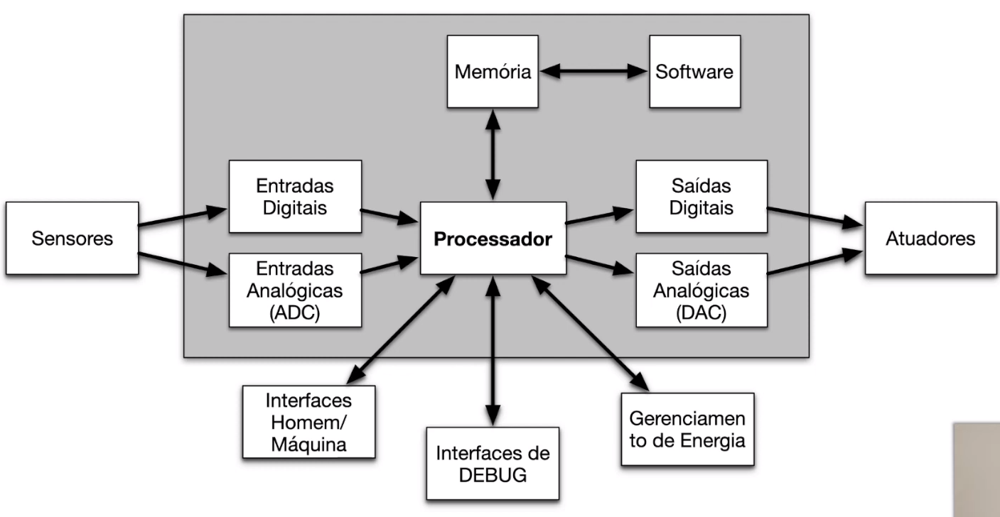
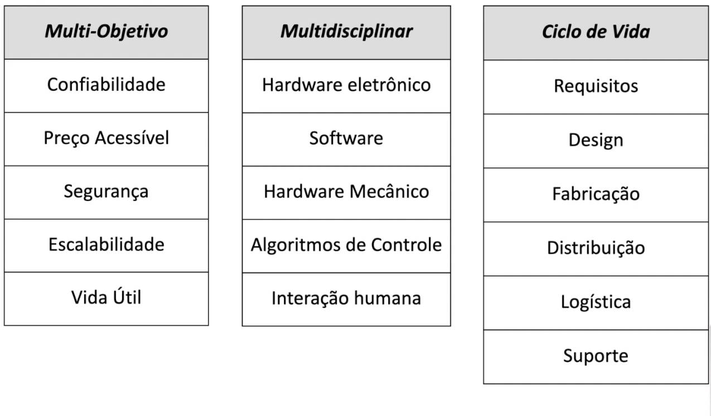
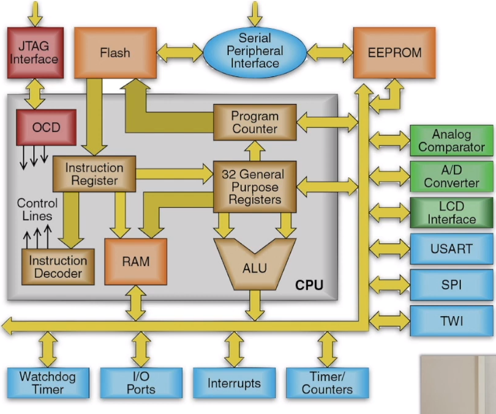
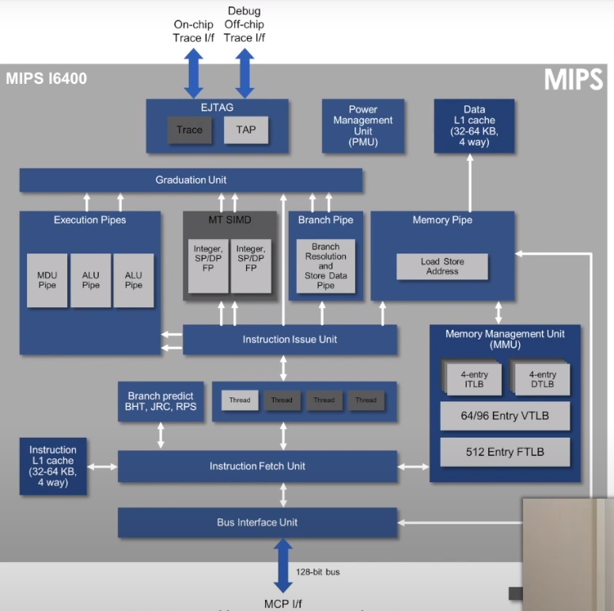
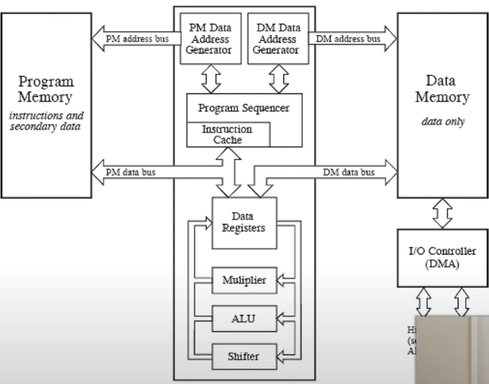
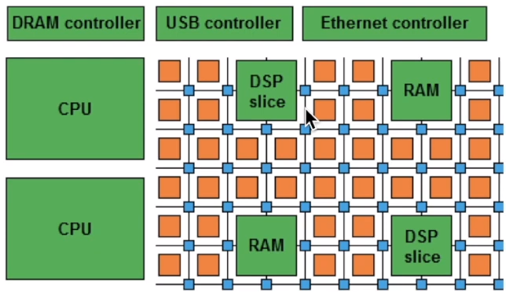

# Introdução aos Sistema embarcados
## O que são sistemas embarcados?
- Combinação de hardware e software combinados para realizar uma atividade específica.
- Sistemas que se acoplam a processos físicos.
- Sistemas microprocessados, o computador é completamente dedicado para um dispositivo ou sistema, realiza tarefas predefinidas.
- Exemplo:
    - Automação residencial.
    - Robôs de indústrias.
    - Aparelhos eletrodomésticos.
 
## Classificações
 
### Sistemas similares à computadores de propósito geral
- Video games, Tablets*, Smartphones*.
### Sistemas de controle
- Controle em malha fechada de sistemas em tempo real.
- Controle de voo, controle de combustão do motor, reator nuclear.
- Controle de eletrodomésticos, automação residencial, etc.
### Processamento de sinais
- Decodificador de TV digital, Radar, Sonar.
### Comunicação e redes
- Telefone celular*, roteadores.
 
## Características
- Sistema computacional específico: Um sistema que possui uma aplicação bem definida/pré-definida. Pensado para executar um conjunto limitado de tarefas.
- Restrições de tempo-real (Deadline: Hard/Soft real-time).
- Confiabilidade (Tolerância a falhas).
- Eficiência energética (Otimizado).
- Baixo custo (Produtos).
- Restrição de memória. (Justamente para também abaixar o custo)
 
## Arquitetura

 
### Hardware
- Processador
- Periféricos
    - Dispositivos de In/Out.
    - Sensores e atuadores
    - Interfaces de comunicação (Protocolos)
- Memória
- Barramento.
 
### Software
- Sistema (OS, RTOS, Compiladores, Simuladores e etc).
- Aplicação
 
## Requisitos de um Software embarcado
- Correção lógica (Deve cumprir bem a tarefa, número mínimo de erros).
- Correção temporal
    - Algo correto no tempo errado não tem validade.
- Tratar concorrência física (Conexão com mundo externo / Todos os sensores devem rodar em harmonia).
- Confiabilidade e tolerância a falhas são críticas. (Ex.: Marca-passo não pode falhar nunca).
- Funcionalidade específica para um fim.
- Multi-tarefa e concorrência
    - Tratar de várias in/out e múltiplos eventos que ocorrem independentemente uns dos outros.
    - Separação simplifica a programação, mas exige a mudança constante para que todos os casos sejam tratados.
    - Executar várias tarefas ao mesmo tempo.
 
## Projeto de um sistema embarcado
- Que tipo de hardware é necessário para o sistema?
    - Que tamanho de palavra do processador (4 bits, 8 bits, 16 bits, ...)
    - Tamanho de memória
- Como podemos atender aos requisitos de tempo? (Ex. TV renderizar imagem rápida).
    - Hardware mais rápido?
    - Software otimizado?
- Minimizar o consumo de energia?
    - Gerenciar módulos de hardware
    - Combinar tarefas para minimizar o acesso à memória.
 
### Pilares dos sistemas embarcados

 
## Arquitetura de Hardware
### Microcontroladores (PIC, AVR, MSP)
- Arquitetura autocontida
- Sistema computacional completo em um circuito.
- Computador em um chip
- Só é necessário definir um Software para utilizá-lo
- Ex.: PIC, AVR, MSP (Utilizados em arduinos).

 
 
### Processadores de propósito geral - GPPs (Intel, ARM e etc)
- Arquitetura dependente de componentes externos.
- Parte de um sistema maior.
- Deve anexar todos os periféricos.
- Ex.: MIPS, Intel i9, AMD Ryzen, ARM

 
### DSPs - Digital Signal Processors (Ex: TMS__)
- Arquitetura específica para operações matemáticas contínuas.
- Arquitetura Harvard (memória de dados e programas separados) é mais rápida.
- Unidades MAC (Multiply-and-accumulate).
- Ex.: Processamento de sinais, Filtros (IRR, FIR, FFT)

 
 
### FPGAs - Field Programmable Gate Arrays
- Circuito integrado com arqu. reprogramável
- Constituído por:
    - Unidades reprogramáveis
    - Unidades de I/O
    - Interconexão por uma matriz de chaves
    - Multiplicadores dedicados
    - Blocos de memória

 
 
### ASICs - Application Specific Integrated Circuits
- Circuitos para tarefas específicas.
- Desenha o processador para uma tarefa específica.
- Às vezes não precisam nem de software.
- Ex.: Gravadores, máquinas fotográficas, eletrodomésticos e etc.
 
### SoCs - System-on-Chip
- Circuitos também específicos, mas com muito mais componentes.
- Possui funções diversas para um único chip.
 
### MPSoCs - Multiple Processor System-on-Chip
- Arq. de níveis mais complexos.
- Múltiplos núcleos e programáveis homogêneos ou heterogêneos.
    - Homogêneos: Diversos núcleos iguais.
    - Heterogêneos: Diversos núcleos distintos.
- Amplamente utilizados em celulares modernos.
- Utiliza-se NoCs(Protocolo TCP interno) para interconexão.
- Ex.: Qualcomm Snapdragon.
 
---

[Link para aula](https://www.youtube.com/watch?v=W5mHjR43vfs&list=PLqvo6YdcIqXXGY1dLbf_xA-JLMBumTyzG&index=1)
 
