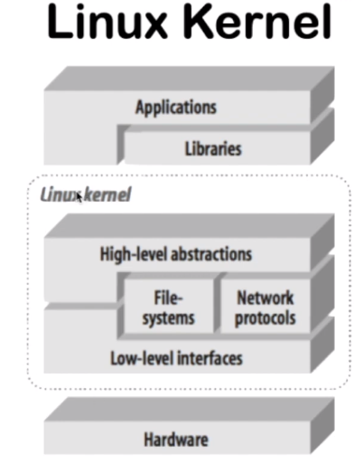
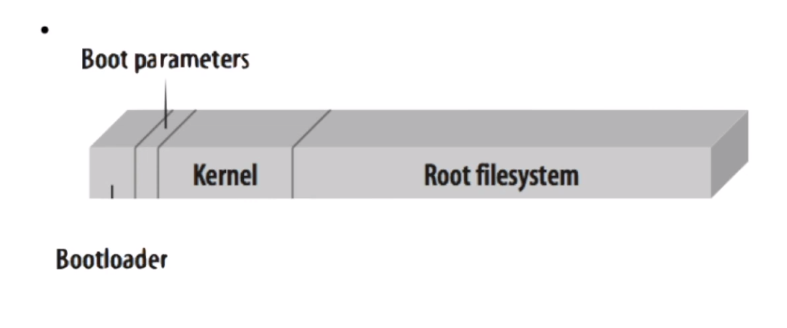
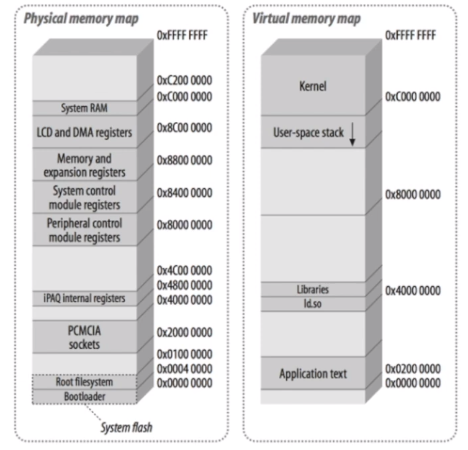

# Kernel do linux
 
## Kernel
 
- Conversa direto com aplicações.
- Deve gerenciar o hardware e prover abstrações de alto nível para programas em modo usuário.
    - Dispositivos
    - Acesso de I/O
    - Controle de processos
    - Compartilhamento de memórias
    - Sinais
    - Etc...
- A partir da abstração do kernel do linux é possível com que aplicações diferentes possam rodar no SO sem nenhum problema.
 

 
### Baixo nível
 
- Mais específico para cada configuração de hardware. 
- Cada Hardware terá uma configuração específica.
- Conversa diretamente com o hardware (controle de paginação e memória)
- Controla CPU e memória
- Interface de low leve
 
### Alto nivel
 
- Gerência de processos e arquivos
- Sockets
- Sinais
- Possui a interface direta com aplicações
 
### Sistema de arquivos
 
- Prove abstração lógica para organização física de arquivos e diretórios
- Dispositivos de armazenamento de memória
 
### Protocolos de Rede
 
- Provê todas as interfaces de rede padrão que o desenvolvedor poderá futuramente usar.
 
### Bibliotecas
 
- Nível de abstração acima do kernel, prove apis e serviços que interagem com o kernel e facilitam o acesso a aplicações.
- Geralmente são linkadas dinamicamente. Cada programa usa uma parte de cada biblioteca. Às vezes não são 100% usadas, somente algumas partes.
 
## Inicialização
 

 
### Bootloader
 
- Inicializa as configurações de hardware e aponta para o kernel
- Pode ser feito em mais de 1 estágio
 - Bootloader 1 e Bootloader 2 (Mais complexo)
- Muito dependente do hardware
- Configurações
   - Armazenamento em memória de estado sólido
   - Disco (Necessita de bootloader anterior)
   - Rede (Necessita de um bootloader com protocolos primários de rede).
 
### Kernel
 
- Inicialização dos serviços de baixo nivel.
- Inicia a BIOS.
 
### Init process
 
- Inicializa alguns serviços básicos para o usuário.
 
## Layout de memória do sistema
 

- Espaço de endereços físicos
    -  A memória física é implementada pelos circuitos integrados de memória, pela eletrônica do computador. Ela possui espaço de endereçamento físico que é o conjunto formado por todos os endereços dos circuitos integrados que formam a memória.
- Espaço de endereços virtuais do Kernel
    - A memória virtual é um espaço que o sistema reserva no HD para salvar as informações armazenadas na RAM e liberar memória para novos aplicativos.
---
 
[Link para Aula](https://www.youtube.com/watch?v=m8PE1ywOLDc&list=PLqvo6YdcIqXXGY1dLbf_xA-JLMBumTyzG&index=2&t=132s)
 
